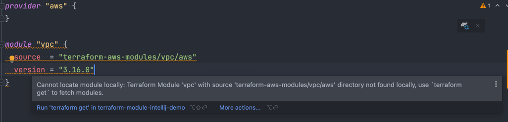

# demo workspace IDEA-287371
This workspace is used to demonstrate a problem in IntelliJ.

[IDEA-287371 Terraform: cannot locate module locally: unknown reason](https://youtrack.jetbrains.com/issue/IDEA-287371#focus=Comments-27-6497910.0-0)

Problem:
The module definition for modules from the terraform standard module registry is not found and IntelliJ marks the corresponding code with the error:
```
Cannot locate module locally: Terraform Module 'vpc' with source 'terraform-aws-modules/vpc/aws' directory not found locally, use `terraform get` to fetch modules.
```
There is no autocomplete available for module variables.

Error-Message in this workspace:


Tool Versions used:
* IntelliJ IDEA 2022.2.2 (Ultimate Edition)
Build #IU-222.4167.29, built on September 13, 2022

* Terraform and HCL Plugin: 222.4167.21
* terraform v1.3.1 (installed via tfenv on macOS 12.6 )

